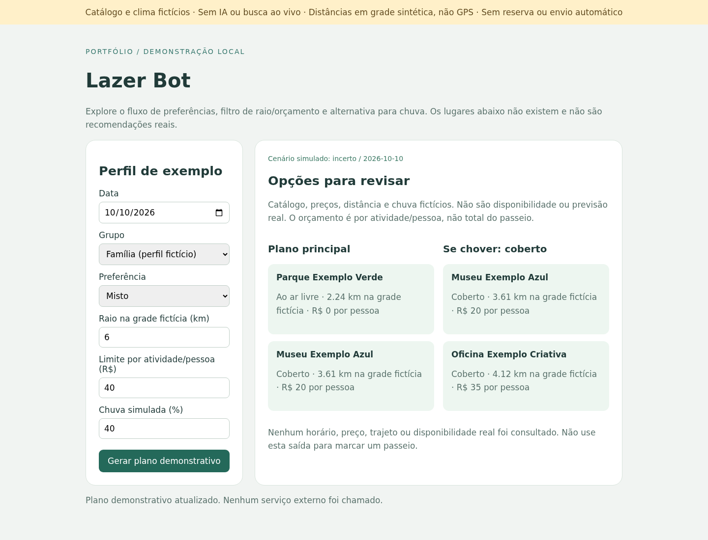

# Lazer Bot

A local, synthetic demonstration of a leisure-planning workflow in Brazilian Portuguese: capture preferences, filter a catalogue and show a rain alternative.

**No AI model, live weather, event search, real venue, GPS, booking or outbound message is used.** All places, prices, distances and weather inputs are invented. This is a reduced demonstration inspired by the original AI Leisure Planner, not the original Telegram/LangGraph service.



## Run

Python 3.10 or newer; no third-party package or key required.

```bash
python3 -m app.server
```

Open `http://127.0.0.1:8002`. Set a synthetic group profile, date, indoor/outdoor preference, radius, per-activity/per-person budget and simulated rain chance. Generate the plan. High simulated rain chooses indoor options even if outdoor is preferred. An empty result means the tiny fictional catalogue has no match, not that real options are unavailable.

The default sample date is October 10, 2026. It is an arbitrary demonstration date, not a scheduled outing. Radius uses a made-up kilometer grid from origin (0, 0), not geographic coordinates or travel estimates. A price limit applies to each activity/person; it is not a total-trip budget. No opening hours, transport, accessibility or real age suitability is checked.

## Scope and provenance

The original project's three-way rain-scenario classifier is extracted into `app/scenario.py`. Its distance/filter and good-weather/rain-fallback workflow informed the new deterministic planner. The catalogue, budget/family filters, local API, browser UI and tests are new. A fictional `family` flag is not a child-safety assessment.

The curated release excludes Telegram, Gemini, LangGraph, geocoding, live weather, web/Instagram event discovery, maps, scheduling, FinOps logging and personal memory/history databases. It does not claim persistent personalization, proactive suggestions or real-world recommendations.

There is no measured generation-speed or onboarding-reduction claim. The original README's performance numbers are not established by this release and are not repeated.

## Tests

```bash
python3 -m unittest discover -s tests -v
```

12 local tests passed on Linux/Python 3.10: weather thresholds, rain/indoor precedence, outdoor/indoor selection, fallback, radius, budget, family flag, invalid dates/numbers and clear synthetic labels. Chromium smoke exercised initial generation, rain-only indoor routing and the uncertain-weather fallback. The screenshot was captured from this running app and inspected. No GitHub CI or remote integration was run.

## Safety and privacy

Loopback-only standard-library HTTP server, no auth or user isolation. The app stores no preferences or plan history, makes no outbound service calls, and does not log request bodies. Do not expose it to a network or put real personal preferences/location into it. Input limits and a browser Origin check are demo controls, not a security audit or production protection.

Before a real service, verify event sources, availability, weather dates, routing and accessibility; add identity/ownership, privacy/retention rules, secure provider configuration and tests. Do not use this demo output to book, pay or commit to an outing.

## License

MIT. See [LICENSE](LICENSE).
